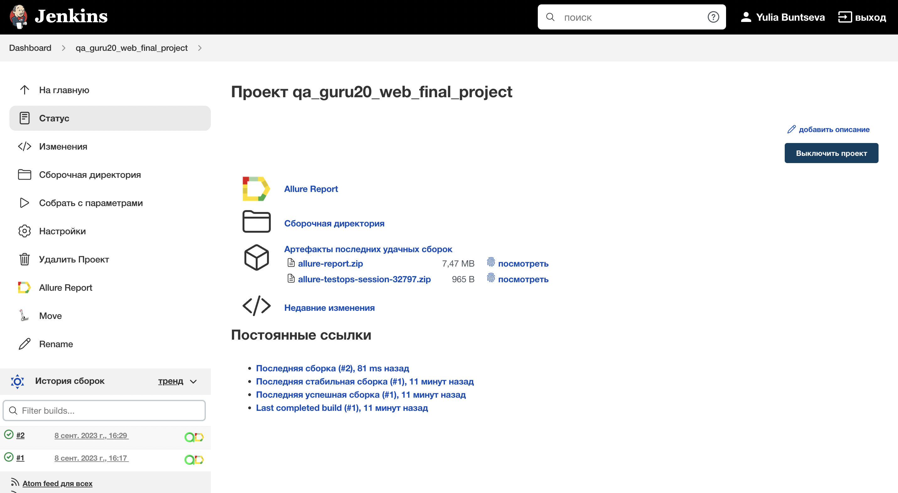
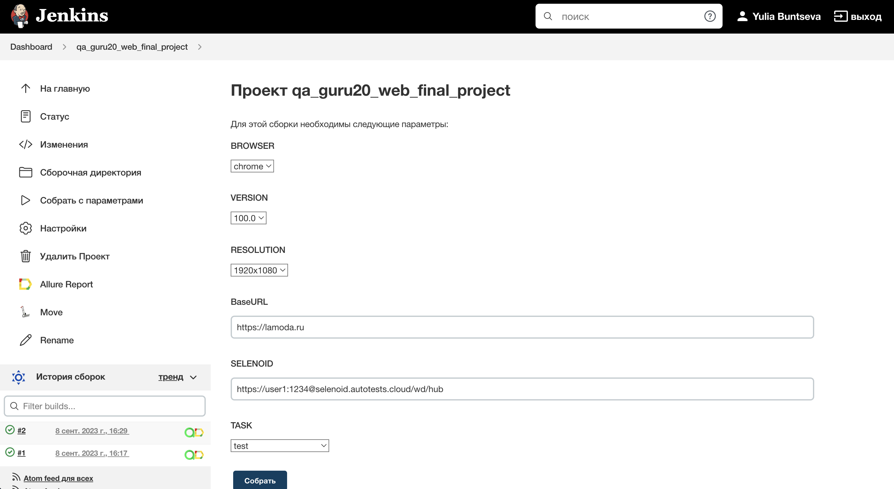
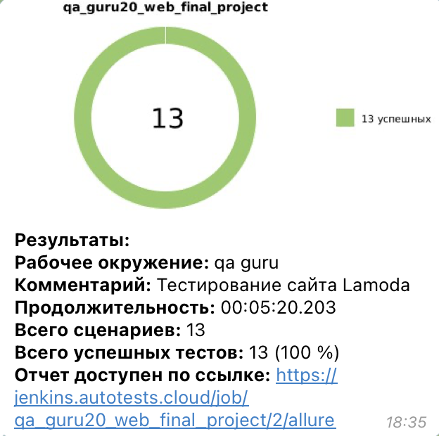
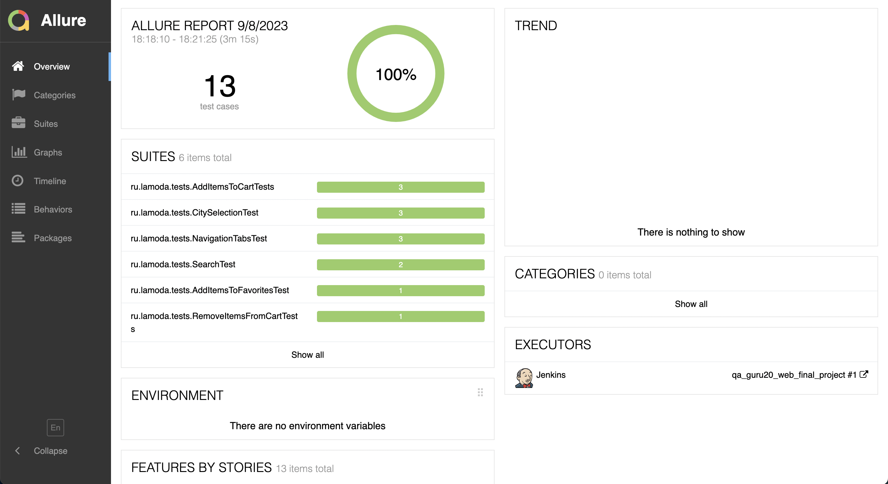
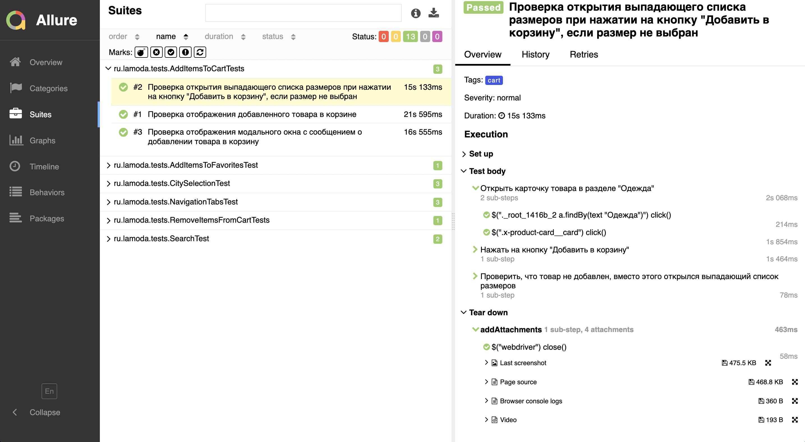
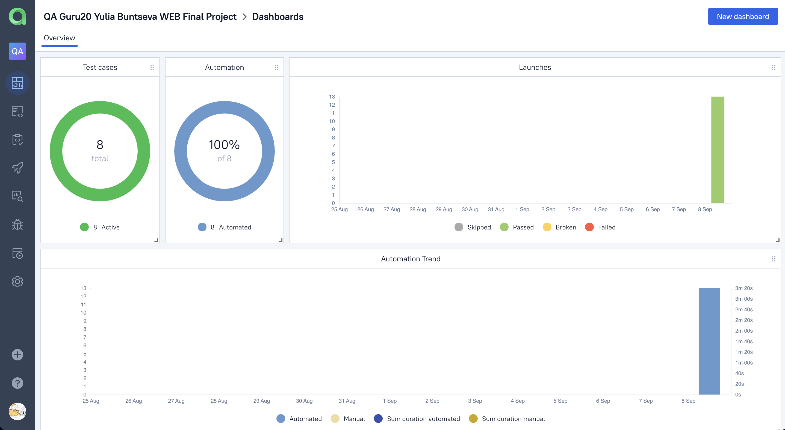
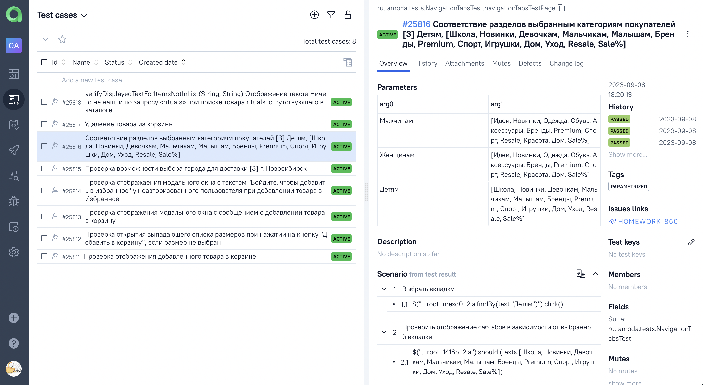
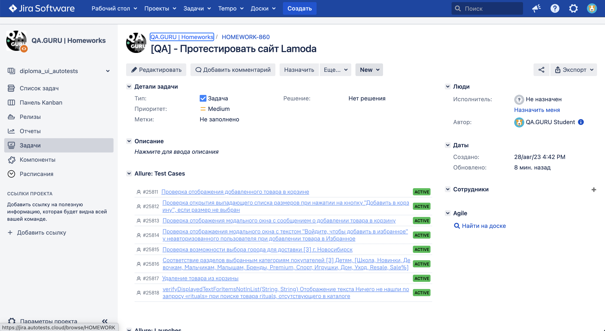
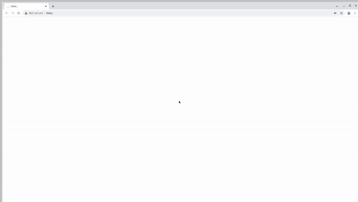

# Проект по автоматизации тестирования для компании Lamoda
<p  align="center">
<a href="https://www.lamoda.ru/"></a>
</p>

> Lamoda - один из крупнейших интернет-магазинов в России и СНГ. С 2014 по 2022 год входил в состав Global Fashion Group.

### :pushpin: Содержание:

+ [Технологии и инструменты](#computer-технологии-и-инструменты)
+ [Варианты запуска](#Варианты-запуска)
    + [Запуск тестов из терминала](#Команды-для-gradle)
    + [Запуск в Jenkins](#-запуск-в-jenkins)
+ [Уведомления в Telegram](#-telegram-уведомления)
+ [Результаты тестов в Allure Report](#-результаты-тестов-в-allure-report)
+ [Интеграция с Allure TestOps](#-интеграция-с-allure-testOps)
+ [Интеграция с Jira](#-интеграция-с-jira)
+ [Видео примера запуска тестов в Selenoid](#-видео-запуска-тестов-в-selenoid)

### :computer: Технологии и инструменты

<p  align="center">
  <a href="https://www.jetbrains.com/idea/"><code></code>
  <a href="https://www.java.com/"><code></code>
  <a href="https://selenide.org/"><code></code>
  <a href="https://aerokube.com/selenoid/"><code></code>
  <a href="https://gradle.org/"><code></code>
  <a href="https://junit.org/junit5/"><code></code>
  <a href="https://github.com/allure-framework/allure2"><code></code>
  <a href="https://qameta.io/"><code></code>
  <a href="https://github.com/"><code></code>
  <a href="https://www.jenkins.io/"><code></code>
  <a href="https://www.atlassian.com/ru/software/jira"><code></code>
  <a href="https://web.telegram.org/"><code></code>
</p>

Автотесты в этом проекте написаны на `Java` с использованием `Selenide` фреймворка.\
`Gradle` - используется как инструмент автоматизации сборки.  \
`JUnit5` - для выполнения тестов.\
`Jenkins` - CI/CD для запуска тестов удаленно.\
`Selenoid` - для удаленного запуска браузера в `Docker` контейнерах.\
`Allure Report` - для визуализации результатов тестирования.\
`Telegram Bot` - для уведомлений о результатах тестирования.

[Вернуться к оглавлению ⬆](#pushpin-содержание)

## <a name="GradleCommand">Команды для Gradle</a>

***Локальный запуск:***
```bash  
gradle clean test
```

***Удалённый запуск через Jenkins:***
```bash  
clean 
${TASK}
-Dbrowser=${BROWSER}
-DbrowserVersion=${VERSION}
-DscreenResolution=${RESOLUTION}
-DbaseUrl=${BaseUrl}
-DremoteUrl=${SELENOID}
```

Дополнительные параметры:
> `-DremoteUrl=` - логин, пароль и адрес удаленного сервера Selenoid\
> `-DbaseUrl=` - адрес тестируемого сайта\
> `-Dbrowser=chrome` - выбор браузера (по умолчанию - chrome)\
> `-DbrowserVersion=100.0` - установка версии браузера\
> `-DscreenResolution=1920x1080` - установка разрешения окна браузера.

[Вернуться к оглавлению ⬆](#pushpin-содержание)

##  <a name="Запуск в Jenkins">Запуск в [Jenkins](https://jenkins.autotests.cloud/job/qa_guru20_web_final_project/)</a>
Главная страница сборки:
<p  align="center">

</p>

Параметризованное задание Jenkins может быть запущено с необходимыми ***Browser***, ***Browser Version***, ***Browser Size*** и ***Task***:
<p  align="center">

</p>

После завершения сборки результаты тестирования доступны в:
>- <code><strong>*Allure Report*</strong></code>
>- <code><strong>*Allure TestOps*</strong></code> - результаты загружаются туда и тест-кейсы могут автоматически обновляться в соответствии с последними изменениями в коде.

[Вернуться к оглавлению ⬆](#pushpin-содержание)

#  <a>Telegram уведомления</a>
После завершения сборки, бот созданный в <code>Telegram</code>, автоматически обрабатывает и отправляет сообщение с результатом.
<p  align="center">

</p>

[Вернуться к оглавлению ⬆](#pushpin-содержание)

#  <a name="AllureReport">Результаты тестов в [Allure Report](https://jenkins.autotests.cloud/job/qa_guru20_web_final_project/2/allure/)</a>

## Главная страница
Главная страница отчета Allure содержит следующие блоки:

>- <code><strong>*ALLURE REPORT*</strong></code> - отображает дату и время теста, общее количество запущенных тестов, а также диаграмму с процентом и количеством успешных, упавших и сломавшихся в процессе выполнения тестов
>- <code><strong>*TREND*</strong></code> - отображает тенденцию выполнения тестов для всех запусков
>- <code><strong>*SUITES*</strong></code> - отображает распределение тестов по сьютам
>- <code><strong>*CATEGORIES*</strong></code> - отображает распределение неудачных тестов по типам дефектов
<p align="center">
  
</p>

## Список тестов с шагами и тестовыми артефактами
На странице список тестов, сгруппированных по наборам, с указанием статуса для каждого теста.\
Может быть показана полная информация о каждом тесте: теги, продолжительность, подробные шаги.

Также доступны дополнительные тестовые артефакты:
>- Screenshot
>- Page Source
>- Browser console log
>- Video

<p align="left">
  
</p>

[Вернуться к оглавлению ⬆](#pushpin-содержание)

#  <a>Интеграция с [Allure TestOps](https://allure.autotests.cloud/project/3657/dashboards)</a>
> Ссылка доступна только авторизованным пользователям.

Выполнена интеграция сборки <code>Jenkins</code> с <code>Allure TestOps</code>.
Результат выполнения автотестов отображается в <code>Allure TestOps</code>
На Dashboard в <code>Allure TestOps</code> отображена статистика пройденных тестов.

Тест-кейсы в проекте импортируются и постоянно обновляются из кода,
поэтому нет необходимости в синхронизации ручных тест-кейсов и автотестов.\
Достаточно создать и обновить автотест в коде и тест-кейс всегда будет в актуальном состоянии.

## Allure TestOps Dashboard

<p align="center">
  
</p>

## Allure TestOps Test Cases

<p align="center">
  
</p>

[Вернуться к оглавлению ⬆](#pushpin-содержание)

#  <a>Интеграция с [Jira](https://jira.autotests.cloud/browse/HOMEWORK-860)</a>
Реализована интеграция <code>Allure TestOps</code> с <code>Jira</code>, в тикете отображается информация, какие тест-кейсы были написаны в рамках задачи и результат их прогона.
<p align="center">
  
</p>

[Вернуться к оглавлению ⬆](#pushpin-содержание)

#  <a>Видео запуска тестов в Selenoid</a>
К каждому тесту в отчете прилагается видео прохождения теста:
<p align="center">
  
</p>

[Вернуться к оглавлению ⬆](#pushpin-содержание)


